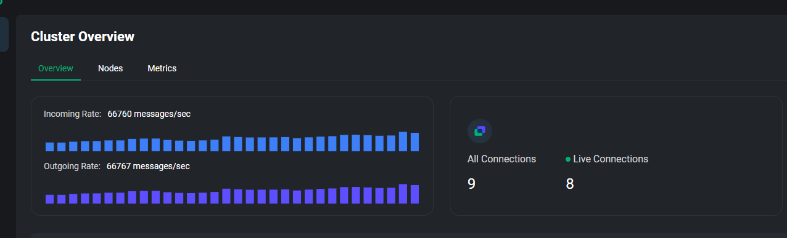

# TurboMqtt Performance

## MQTT 3.1.1 Benchmarks

Via [`Mqtt311End2EndTcpBenchmarks.cs`](../benchmarks/TurboMqtt.Benchmarks/Mqtt311/Mqtt311End2EndTcpBenchmarks.cs)

```

BenchmarkDotNet v0.13.12, Windows 11 (10.0.22631.3447/23H2/2023Update/SunValley3)
12th Gen Intel Core i7-1260P, 1 CPU, 16 logical and 12 physical cores
.NET SDK 8.0.101
  [Host]     : .NET 8.0.1 (8.0.123.58001), X64 RyuJIT AVX2
  Job-EYKSZI : .NET 8.0.1 (8.0.123.58001), X64 RyuJIT AVX2

InvocationCount=1  LaunchCount=10  RunStrategy=Monitoring  
UnrollFactor=1  WarmupCount=10  

```
| Method                    | QoSLevel    | PayloadSizeBytes | ProtocolVersion | Mean      | Error     | StdDev   | Req/sec    |
|-------------------------- |------------ |----------------- |---------------- |----------:|----------:|---------:|-----------:|
| **PublishAndReceiveMessages** | **AtMostOnce**  | **10**               | **V3_1_1**          |  **4.453 μs** | **0.5012 μs** | **1.478 μs** | **224,583.72** |
| **PublishAndReceiveMessages** | **AtLeastOnce** | **10**               | **V3_1_1**          | **24.358 μs** | **0.8365 μs** | **2.466 μs** |  **41,054.14** |
| **PublishAndReceiveMessages** | **ExactlyOnce** | **10**               | **V3_1_1**          | **39.245 μs** | **3.0092 μs** | **8.873 μs** |  **25,480.94** |


Every benchmark includes 100% of this overhead:

1. `Publisher` --> `Broker`
2. `Broker` --> `Publisher` (at QoS > 0)
3. `Subscriber` --> `Broker`
4. `Broker` --> `Subscriber` (this is primarily what we are interested in)

In other words, this benchmark __is significantly more comprehensive that just measuring raw receive overhead__, especially with `QualityOfService.AtLeastOnce` (1) and `QualityOfService.ExactlyOnce` (2), which require 4x and 16x the amount of end-to-end communication that `QualityOfService.AtMostOnce` (0) does. Therefore, if you're interested in pure receiving or publishing rates, you will get significantly higher values than what this benchmark records.

### Why design the benchmark this way?

We designed the benchmark to include _everything_ in order to make it `git clone` + `dotnet run -c Release` runnable right out of the box. That's the standard for best developer experience, but that means making some comrpomises on accuracy.

### Why the `10b` message size?

We stuck with a relatively low message size because doing anything larger is mostly a matter of scaling `Socket` buffer sizes, and when we perform end-to-end benchmarking with real brokers like [EMQX](https://www.emqx.io/) larger message sizes create memory pressure + availability problems for the broker itself. You can run these yourselves at larger sizes.

But the TL;DR; is: big messages are largely I/O bound problem - the whole purpose of TurboMqtt is make sure your publishing / receive message processing rates aren't CPU bound. Smaller message sizes make that easier to observe.

### Data with Real Brokers

What sort of performance can you expect from real brokers?



Using some of our application-specific stress tests, we've observed processing rates of ~70k msg/s (as fast as the stress testers could go against a single EMQX instance) running on `QualityOfService.AtLeastOnce` (QoS=`1`) - which is significantly faster than our benchmark data (see, we told you!)

Testing with larger packet sizes, such as 8kb packets, we've observed rates of around 35k msg/s, which translates to roughly 280 mb/s with a single client receiving messages. At those sizes you'll start to run into problems with your message broker long before TurboMqtt has any problems.
